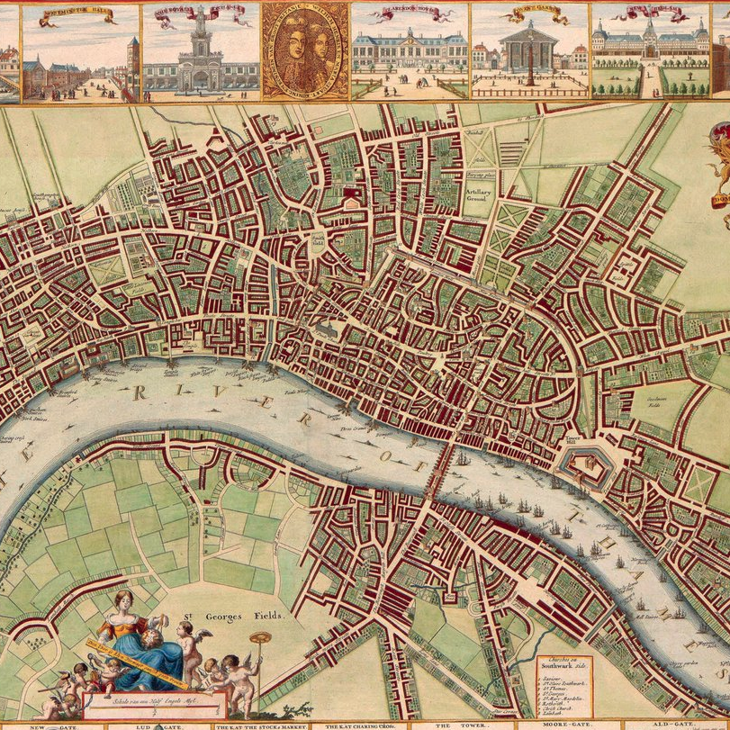

# pipelinehouses
This is the second proyect for Ironhack.

The proyect itself has a few different steps:
- To choose a dataset from Kaggle. In my case I take the average housing prices in London during the last 25years.
- Clean the dataset to use the information we need. 

